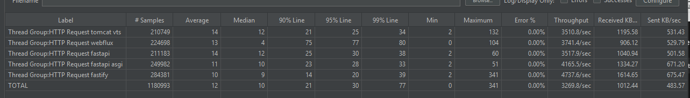

# Benchmark Summary

Resumo comparativo dos resultados (30s cada teste, 20 threads, 100 conexões):   

| Framework / impl      | Requests/sec | Avg Latency  | p50    | p75     | p90     | p99      | Total reqs  | Dur   | Transfer/sec |
|-----------------------|--------------:|------------:|-------:|--------:|--------:|---------:|------------:|------:|-------------:|
| MY_FRAMEWORK          | 69,342.35     | 9.18 ms     | 1.16 ms| 1.99 ms | 12.52 ms| 305.46 ms| 2,127,509  | 30.68s | 9.85 MB/s    |
| PYTHON PURO           | 83,285.04     | 9.81 ms     | 1.11 ms| 1.53 ms | 2.13 ms | 416.24 ms| 2,567,702  | 30.83s | 12.15 MB/s   |
| FASTAPI               | 48,858.39     | 9.77 ms     | 1.94 ms| 2.51 ms | 3.08 ms | 385.12 ms| 1,501,396  | 30.73s | 6.85 MB/s    |
| JAVA - UNDERTOW       | 61,612.80     | 13.57 ms    | 1.07 ms| 11.79 ms| 34.26 ms| 250.13 ms| 1,897,481  | 30.80s | 8.93 MB/s    |
| JAVA - WEBFLUX        | 65,605.29     | 11.97 ms    | 1.42 ms| 1.99 ms | 2.74 ms | 499.23 ms| 2,025,785  | 30.88s | 5.69 MB/s    |

## Config usada

A configuração de recursos utilizada durante os testes:

```yaml
resources:
  limits:
    cpus: "4"      # máximo 1.0 CPUs
    memory: 1g     # máximo 1GB RAM
```

Observações rápidas:
- "Requests/sec" já está no formato final reportado pelo benchmark.
- P90/P99 mostram cauda — implementar melhorias de tail latency pode reduzir p99 dramaticamente.
- Python puro teve maior Requests/sec neste teste; FastAPI apresentou menor throughput entre Python.
- Use estes números como referência — repita testes com cargas/variantes de configuração para validar.

